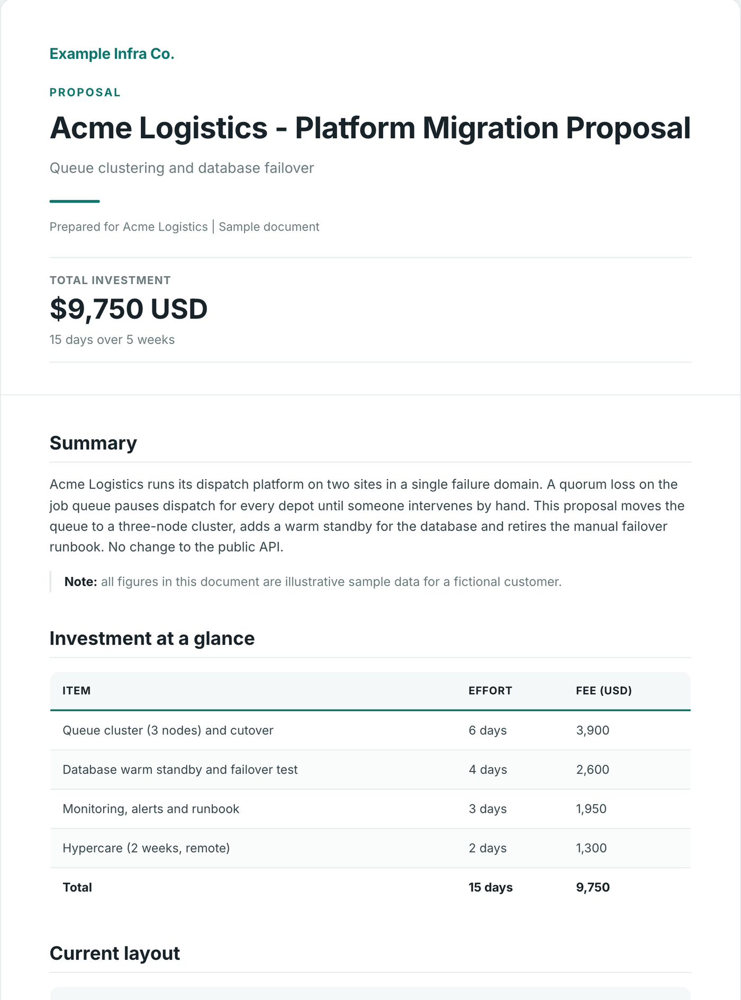
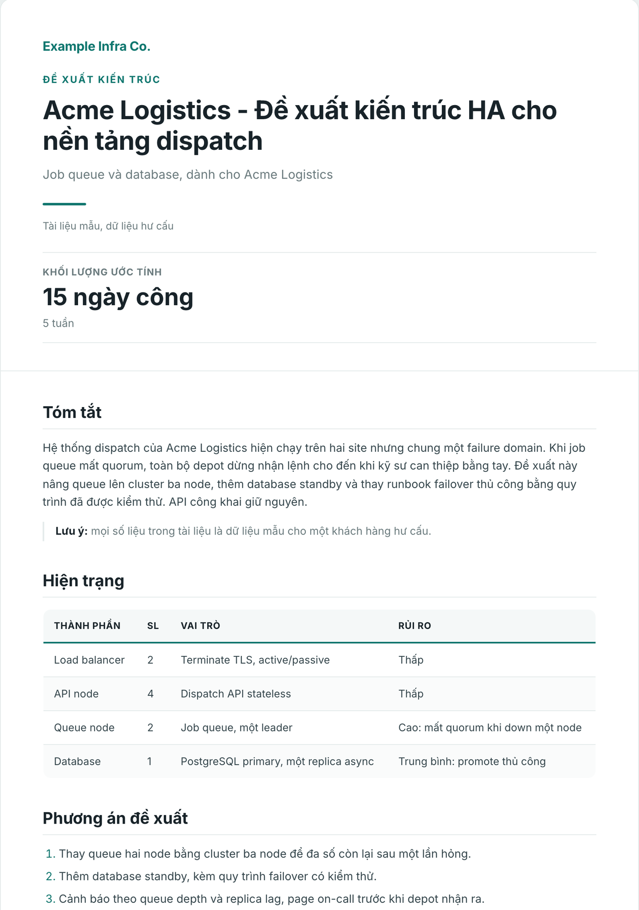

# claude-skills

Claude Code skills for infrastructure documentation: architecture docs, Figma topology
diagrams and decks, clean HTML/PDF, and Vietnamese technical writing.


<p align="center"></p>

<p align="center"><sub>`examples/sample.md` rendered with <code>doc-builder</code> (fictional data).</sub></p>

## What is inside

Six skills in three plugins.

| Plugin | Skill | What it does | Needs |
|---|---|---|---|
| tech-docs | `doc-builder` | Markdown to a clean HTML document, optionally PDF. Strips AI-tell typography and emoji. | Python 3, pandoc, Chrome for `--pdf` |
| tech-docs | `architecture-doc` | Customer-facing Architecture and Requirements document plus a Deployment Guide, with a fact-check pass for sizing and quorum numbers. | none (uses `doc-builder`, `figma-topology`) |
| figma-diagrams | `figma-topology` | Infrastructure topology diagrams drawn in Figma from a fixed set of tokens, icons and archetypes. | Figma MCP server, `figma:figma-use` |
| figma-diagrams | `figma-presentation` | Slide decks in Figma Slides using the same design system. | Figma MCP server, `figma:figma-use-slides` |
| viet-writing | `viet-lach` | Vietnamese document structure: 9 structures, 6 formats, 6 domain presets, style rules. | none |
| viet-writing | `viet-ky-thuat` | Vietnamese technical writing that keeps English terms engineers actually use, plus EN/VI parity rules. | none |

## Screenshots

<p align="center"></p>

`examples/sample-vi.md`: a Vietnamese document in the hybrid style `viet-ky-thuat` writes, rendered by the same `doc-builder` script.

## Quickstart

Install as plugins:

```
/plugin marketplace add mqa8668/claude-skills
/plugin install tech-docs@claude-skills
/plugin install figma-diagrams@claude-skills
/plugin install viet-writing@claude-skills
```

Or copy the skills into `~/.claude/skills`:

```bash
git clone https://github.com/mqa8668/claude-skills.git
cd claude-skills
./scripts/install.sh            # add --force to replace existing copies
```

Try `doc-builder` without Claude:

```bash
python3 plugins/tech-docs/skills/doc-builder/scripts/build_doc.py examples/sample.md \
  --eyebrow "Proposal" --subtitle "Queue clustering and database failover" \
  --meta "Prepared for Acme Logistics | Sample document" --brand "Example Infra Co." \
  --stat '$9,750 USD' --stat-label "Total investment" --stat-note "15 days over 5 weeks" \
  --footer "Sample data - fictional customer"
# writes examples/sample.html (the hero screenshot); add --pdf for a PDF
```

`scripts/screenshots.sh` rebuilds both screenshots (needs Playwright chromium).

`--pdf` uses headless Chrome. Set `CHROME` to a Chrome or Chromium binary, or put
`google-chrome` / `chromium` on PATH. On macOS the default app location is tried last.

## How they fit together

`viet-lach` decides the structure of a Vietnamese document, and `doc-builder` renders it.
`figma-topology` draws the diagrams, and `architecture-doc` assembles them into the
deliverable. `figma-presentation` reuses the topology design tokens for slides, so a
diagram can be dropped into a deck unchanged. Skills reference each other by name; install
the plugins you need together.

## Design choices

- **Typography sanitizer.** `doc-builder` turns em and en dashes into `-`, arrows into
  `->`, smart quotes into straight quotes, and removes emoji, so the output reads as typed
  by a person. Technical English is left alone. CI tests this.
- **Diagrams live in Figma, never in ASCII.** They are exported as images and embedded.
- **EN/VI parity.** `viet-ky-thuat` checks that the Vietnamese copy has the same headings,
  tables and figures as the English one.
- **Fact-check pass.** `architecture-doc` ends with a check of counted things (nodes,
  databases), quorum sizes and capacity sums against the diagrams and tables.

## Tiếng Việt

`viet-lach` giúp chọn cấu trúc cho tài liệu, báo cáo, slide tiếng Việt (Diátaxis, Minto,
SCQA, PREP, README, Runbook, ADR và các kiểu khác) cùng văn phong kỹ thuật. `viet-ky-thuat`
dành cho tài liệu hạ tầng và bảo mật: giữ nguyên thuật ngữ tiếng Anh mà kỹ sư thật sự dùng,
chỉ dịch những từ đã có nghĩa quen thuộc, và có checklist để bản EN và VI khớp nhau.

## Limits

- The Figma skills need the Figma MCP server and its own `figma-use` skills. They do not
  work without them.
- PDF output needs Chrome or Chromium. HTML output does not.
- Sample images in this README are made from fictional content.

## License

MIT, see [LICENSE](LICENSE). Icon glyphs derived from Feather are credited in
[THIRD_PARTY_NOTICES.md](THIRD_PARTY_NOTICES.md). Author: [Loc Luong](https://github.com/mqa8668).
